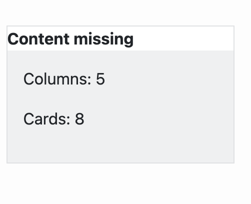

# Helvetic Ruby workshop (Riccardo random and quick notes)

dont complain about typos, im taking notes while coding and turning my hnead to look at slides.

Riccardo doensloaded the original repo.

* `rbenv install 3.3.3`

## Feedback for authors.

1. Love the workshop. For me who I'm a backend dev, a little touch on FE side is great and new and hard enough to make it interesting.
2. Love the github foldable triangles in the README, REALLY well done.
3. I love even more the fact i can git checkout a different branch with solution to step 1,2,3.. as a workshop owner myself, thats a tech i'm actually exploring. I have more quesiton about this - over a beer! :)
4. I honestly am a bit lost on seeing the solutions in [PR](https://github.com/visualitypl/hotwire-kanban/pulls). I dont get this. Would love the TITLE of the PRs to be numbered 1 to 6, it would help. Like, which is the task 4 for instance which i screwed up in my app? :) Please observe my screw up in its glory:
4. Michal asked me which workshops I curate. Here are my workshops ([appmod](https://codelabs.developers.google.com/codelabs/app-mod-workshop) and [Game with gemini](https://codelabs.developers.google.com/codelabs/gemini-games-firebase)).

5. As I've told Michal already, put ONE slide to explain the Schema/ORM, you have 3 classes and took me to understand that a board has many columns and a column has many cards. Easy peasy once you get it but its a `Bo > Co > Ca` and one ER diagram in one slide would go a long way. This would help me understand why in the card views i have all these columns thingies but not the board thingies... for instance. Plus where I work, columns are somewhat static (bug status) so i would expect 2 classes, not 3.

## hotwire

has 3 parts:

1. ❌ **Native** handles  Mobile. Skip today
2. ❌ **stimulus**: way it handles javascript - skip today
3. 👍 **Turbo**. min part of the day. every ROR dev SHOJLD know.

## Tubro

want to make user more comfortbale. What if we dont need a full page reload?

## **Turbo Drive**

Optimizes 💩 out of it.

We click the link and turbo overrides the DFLT behaviour. it rewrites this behaviour and updates the history, the API,
so there's a change in the URL, you think it all works as usuakl, then turno does thje same request on his own.
instead of GET, it does FETCH.
when its rendered on server, Tubro detexts this change. if the same JS style on same page, it wont replace it,
it will just give the HTML. or download the IMG we were missing, but wont re fetch the new one.

* This happens automatically if you include hotwire-turbio. Just add yourself. You can disable it, in new turbo.
* To disable it, just add `<body data-turbo="false">` or in a div.

## **Turbo frames**

Then we have **Turbo frames**.

They isolate some partial diffs and replace JUST this one, like 💨 **Turbo Drive**.

* IDs need to be consistent. If frame id tag doesnt stay the same, you get "Content Missing error".

We need 2 methods:

1. TurboFrame helkper which is used in the VIEW
2. `dom_id()` method. works with all models. From `"Card.find(45)"` -> `card_45`.

## Exercise 1. lets implement one with EDIT IN PLACE

done. Wow, it works!

## exercise 2

done

## 3

done

woopsie! Content missing

there is a special frame called `_top`.

## Turbo Streams

### TS.Task1 Task 1: Fix deleting cards

## Task 4: Create new Cards with Turbo Streams

Wow, this is the MOST advanced. You click on + icon, you dont want to create a create in place.
which is cool!

1. lets wrap the + button ina  turbo frame, this time for CREATE not EDIT.
2. Make sure our server renders the oproiper turbo stream that will add the newly created card to the columna nd will render the plux button.

## Task 5: Create new Boards with Turbo Streams

No solution here.
Try to implement it on your own. You can do it! 💪
Or, checkout to branch with solution.

You wish :)

< i lost something here>

At the end: `git checkout turbo-frames-creates`

## Turbo Broadfcasts

* action cable
* WebSockets.

Let your server push HTML and update all connected client webpages. good for:

* Kanban Boards
* Chat
* Dashboards

task

## Solution to multi columns.

1. Solution1 would be to use "hot columns", get them from DB and render them this way. would be the simplest and more elewgant.
   However, this wont work.
2. this is how we did it commercially. We have a serializer .. harder solution to write, with lot of JS.
