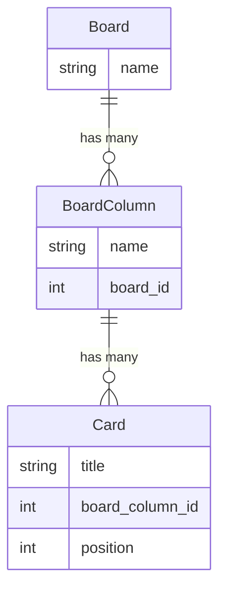

# Entity Relationship Diagram

This document explains the main models in the application and visualizes their relationships using a Mermaid.js Entity Relationship Diagram.

## Models Explanation

### Board
Represents a Kanban board. It is the top-level container for columns and cards. Each board has a name and can have many board columns.

### BoardColumn
Represents a column within a Kanban board. Each column belongs to a specific board and can contain many cards. Columns have a name.

### Card
Represents a task or item within a board column. Each card belongs to a specific board column, has a title, and maintains its order within the column using `acts_as_list`.

## ER Diagram

